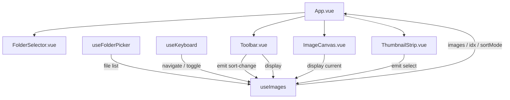

# imgob 重构计划 — Vue 3 + Vite

## 1. 项目概述

将现有单文件 vanilla HTML/JS 图片查看器重构为 Vue 3 + Vite 工程化项目。核心改动：**从选择多个文件 → 选择整个文件夹**，新增排序功能，优化图片展示。

## 2. 技术栈

| 层面 | 选型 | 说明 |
|------|------|------|
| 框架 | Vue 3 (Composition API + `<script setup>`) | 官方推荐写法 |
| 构建 | Vite 5 | Vue 官方推荐构建工具 |
| 包管理 | npm（`node_modules` 位于项目根目录，不污染全局） | 随项目隔离 |
| 代码规范 | ESLint + Prettier | `@vitejs/plugin-vue` 自带 ESLint 集成 |
| CSS | Scoped `<style>` + CSS custom properties | 组件级隔离 + 全局主题变量 |
| 状态管理 | Vue Composition API（`ref` / `reactive`） | 项目简单，无需 Pinia |
| 图片加载 | `URL.createObjectURL()` | 相比 base64 更省内存，可 revoke |

## 3. 项目结构

```
imgob/
├── index.html                     # Vite 入口 HTML
├── package.json
├── vite.config.js
├── eslint.config.js
├── .prettierrc
├── .gitignore
├── AGENTS.md                      # 已有，需更新
├── README.md
├── public/
│   └── favicon.svg
└── src/
    ├── main.js                    # Vue 应用入口
    ├── App.vue                    # 根组件（布局骨架）
    ├── components/
    │   ├── ImageCanvas.vue        # 核心：图片渲染区（全屏/自适应）
    │   ├── FolderSelector.vue     # 文件夹选择入口 + 拖拽区域
    │   ├── Toolbar.vue            # 排序切换 / 图片计数 / 文件名显示
    │   └── ThumbnailStrip.vue     # 底部缩略图条（可选显示/隐藏）
    ├── composables/
    │   ├── useImages.js           # 图片列表状态、加载、排序
    │   ├── useKeyboard.js         # 键盘快捷键（左右箭头、全屏等）
    │   └── useFolderPicker.js     # 文件夹选择逻辑（含降级方案）
    └── assets/
        └── main.css               # 全局 reset + CSS 变量
```

## 4. 组件树 & 数据流



- **状态集中在 `useImages`**：`imageList`（排序后的图片对象数组）、`currentIndex`、`sortMode`、`sortAsc`。
- **`App.vue`** 调用 composable，通过 props 向下分发，通过 emits 向上传递事件。
- **无跨组件状态共享需求** — 不引入 Pinia。

## 5. 核心功能设计

### 5.1 文件夹选择

- **主方案**：File System Access API — `window.showDirectoryPicker()`
  - 优势：用户体验佳，直接弹出系统文件夹选择器
  - 约束：需要安全上下文（localhost / HTTPS），Vite 开发服务器天然满足
- **降级方案**：`<input type="file" webkitdirectory>`
  - 兼容不支持 File System Access API 的浏览器（Firefox 等）
- 递归读取文件夹内所有图片文件（不递归子目录，避免性能问题）
- 支持的格式：`.jpg`, `.jpeg`, `.png`, `.gif`, `.webp`, `.svg`, `.bmp`, `.avif`

### 5.2 排序

| 排序方式 | 实现 |
|----------|------|
| 按名称 | `file.name` 使用 `localeCompare` 进行自然排序 |
| 按时间 | `file.lastModified`（修改时间） |
| 按大小 | `file.size` |
| 自定义 | 拖拽缩略图调整顺序（`ThumbnailStrip` 内实现 HTML5 Drag & Drop） |

- 每种排序支持升序/降序切换
- 排序状态通过 `Toolbar` 按钮组展示

### 5.3 图片显示

- 使用 `` + CSS `object-fit: contain`，替代原始 Canvas 方案
  - 保持原始比例，图片尽可能占满可用空间
  - 暗色背景（`#1a1a1a`）衬托图片
- 可用区域 = 视口高度 - 顶部工具栏（约 48px）- 底部缩略图条（可选，约 80px）
- 图片加载状态：显示 loading 占位符
- 图片加载失败：显示错误占位符 + 文件名
- **EXIF 方向处理**：使用 `image-orientation: from-image` CSS 属性

### 5.4 导航

| 操作 | 触发方式 |
|------|----------|
| 下一张 | 键盘 → / 点击图片右侧区域 / 缩略图点击 |
| 上一张 | 键盘 ← / 点击图片左侧区域 |
| 第一张 | 键盘 Home |
| 最后一张 | 键盘 End |
| 全屏切换 | 键盘 F / 双击图片 / Toolbar 按钮 |
| 切换缩略图条 | 键盘 T |

- 循环导航：最后一张 → 下一张 → 回到第一张（可配置）
- 移动端：左右滑动手势（touchstart/touchend）

### 5.5 全屏模式

- 使用 Fullscreen API：`element.requestFullscreen()`
- 全屏下隐藏工具栏和缩略图条，仅显示图片
- 鼠标移动时临时显示工具栏（类似视频播放器）

### 5.6 内存管理

- 使用 `URL.createObjectURL(file)` 生成 blob URL，不转 base64
- 图片对象结构：`{ file, url, name, size, lastModified }`
- 选择新文件夹时：遍历 revoke 所有旧 blob URL，再加载新图片
- 不再使用 `FileReader.readAsDataURL()`（内存占用约为 blob URL 的 1.33 倍）

## 6. 边缘情况 & 容错

| 场景 | 处理 |
|------|------|
| 空文件夹 | 显示 "文件夹中没有图片" 提示 |
| 单张图片 | 隐藏导航按钮，不显示缩略图条 |
| 损坏的图片文件 | `img.onerror` 捕获，显示占位符，不阻塞其他图片 |
| 不支持的格式 | 静默跳过，不计入列表 |
| 超大图片（> 几十 MB） | 异步加载，不阻塞 UI；在 Vite 配置中不做额外处理（浏览器原生解码） |
| 文件夹权限被拒 | 捕获 DOMException，提示用户重试 |
| 浏览器不支持 File System Access API | 自动降级至 `webkitdirectory` input |
| 拖拽自定义排序后切换文件夹 | 排序模式重置为 "按名称" |
| `file://` 协议直接打开构建产物 | File System Access API 不可用，需提示使用 `webkitdirectory` 降级 |

## 7. 视觉设计要点

- **暗色主题**：深色背景 `#1a1a1a`，白色文字，降低视觉疲劳
- **工具栏**：顶部 48px 半透明黑底，悬浮于图片之上
- **缩略图条**：底部 80px，横向滚动，当前图片高亮边框
- **图片区**：中间剩余全部空间，垂直/水平居中
- **过渡动画**：图片切换 fade 过渡（`transition: opacity 0.2s`）
- **响应式**：移动端工具栏不悬浮，改为固定在顶部；缩略图条高度缩减至 60px

## 8. 配置文件要点

### `vite.config.js`
```js
import { defineConfig } from 'vite'
import vue from '@vitejs/plugin-vue'

export default defineConfig({
  plugins: [vue()],
  server: {
    host: '0.0.0.0',   // 允许局域网访问
    port: 5173,
  },
})
```

### `package.json` scripts
```json
{
  "scripts": {
    "dev": "vite",
    "build": "vite build",
    "preview": "vite preview"
  }
}
```

- `npm run dev` — 启动开发服务器
- `npm run build` — 生产构建至 `dist/`
- `npm run preview` — 预览生产构建

## 9. 分步实施计划

### Phase 1：项目脚手架
1. `npm create vite@latest . -- --template vue` 初始化项目（在当前目录）
2. 安装依赖：`npm install`
3. 配置 `vite.config.js`、`.prettierrc`、`eslint.config.js`
4. 清理 Vite 模板默认文件
5. 创建 `src/` 目录骨架

### Phase 2：核心 Composable
6. 实现 `useFolderPicker.js` — 文件夹选择（含降级）
7. 实现 `useImages.js` — 图片加载、状态管理、排序逻辑
8. 实现 `useKeyboard.js` — 键盘快捷键绑定

### Phase 3：UI 组件
9. 实现 `FolderSelector.vue` — 文件夹选择入口 UI
10. 实现 `ImageCanvas.vue` — 图片展示核心组件
11. 实现 `Toolbar.vue` — 工具栏（排序、计数、全屏）
12. 实现 `ThumbnailStrip.vue` — 缩略图条（含拖拽排序）

### Phase 4：整合 & 打磨
13. 在 `App.vue` 中组装所有组件
14. 全局样式 & CSS 变量定义
15. 过渡动画 & 交互细节
16. 全屏模式支持
17. 移动端触摸手势
18. 降级方案测试

### Phase 5：收尾
19. 更新 `AGENTS.md`
20. 更新 `README.md`
21. 移除旧版 `index.html`（或归档）
22. 确保 `.gitignore` 包含 `node_modules/`、`dist/`

## 10. 不做的事项（明确排除）

- 单元测试 / E2E 测试（用户自行处理）
- 图片编辑功能（裁剪、旋转、滤镜等）
- 云端存储 / 上传
- URL 状态持久化（刷新后重置）
- 国际化（仅中文）
- PWA / Service Worker
- 子目录递归扫描（保持简单，仅扫描选定目录一级）

## 11. 潜在风险 & 未明确事项

- **File System Access API 兼容性**：Firefox 不完全支持，需确保降级方案可靠。建议首次使用时做能力检测并缓存结果。
- **大量图片性能**：文件夹内图片超过 500 张时，缩略图渲染可能卡顿。可考虑虚拟滚动（但暂不实现，作为后续优化项）。
- **blob URL 生命周期**：必须在选择新文件夹时 revoke 所有旧 URL，否则内存泄漏。在 `useImages` 的 `watch` 或清理函数中处理。
- **`vite build` 产物**：构建后的静态文件通过 `file://` 打开时 File System Access API 不可用。在 README 中说明推荐使用 `npm run preview` 或部署到 localhost。
